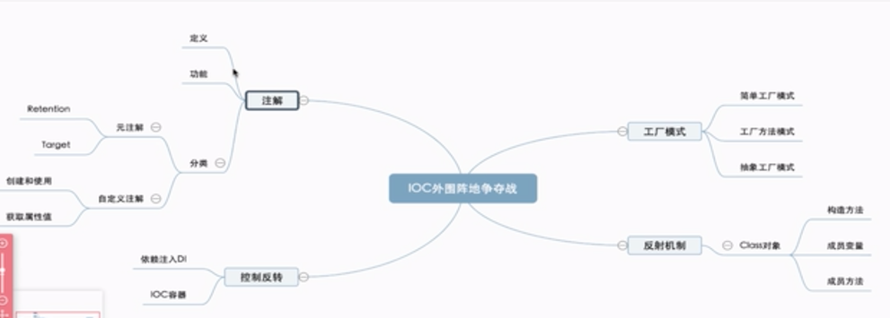
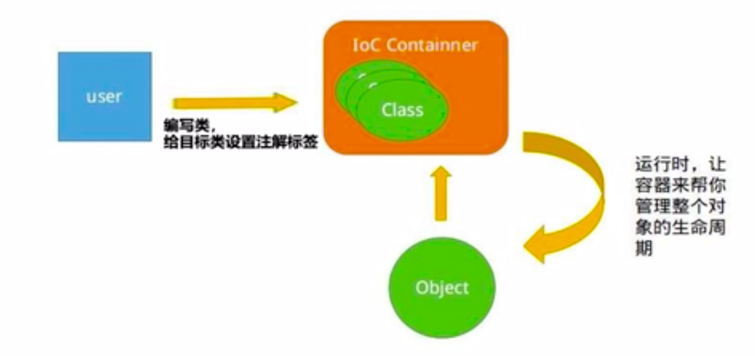
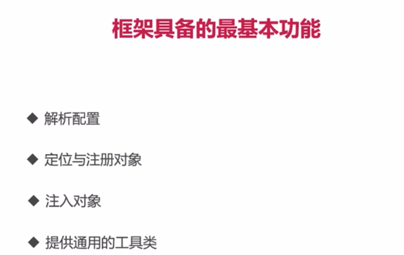

### JSP
### 单一原则
### 门面模式 Facade Pattern
### 泛型 Generics
- 1、让数据类型变得参数化
```
1) 定义泛型的时候，对应的数据类型是不确定的
2) 泛型方法被调用的时候，会指定具体的类型
3) 核心目标: 解决容器类型在编译时候的安全检查问题
```

- 2、泛型通配符 ?
```
Number 为上边界
<? extends Number>
```

```
下边界
<? super Integer>
```

### 拦截所有请求
```
/ => 拦截所有请求，不包含jsp
/* => 拦截所有请求，包含jsp
```

- 3、工厂模式
```
1) 定义一个工厂类，根据传入的参数的值不同返回不同的实例。
2) 延迟工厂模式
3) 抽象工厂模式
```

- 4、反射
```
IOC 是工厂模式与反射的集合
反射类 依赖Class，只有JVM能够创建Class类的实例
JVM中只有一个和类相对应的Class对象来描述其类型信息
1) 获取Class对象的三种方式
object -> getClass()
任何数据类型（包括基本数据类型）都有一个"静态"的class属性
通过Class类的静态方法：forName(String className) (常用)
2) 反射的获取源
用注解来保存类相关的信息以供反射调用
```

- 5、注解
```
提供一种为程序元素设置元数据的方法
    元数据是添加到程序元素如方法、字段、类和包上的额外信息
```

```
JDK启动的时候添加VM options参数
-Djdk.proxy.ProxyGenerator.saveGeneratedFiles=true
根据生成的类可以查看到invocation

-XX:+TraceClassLoading 跟踪类加载
```

- 6、注解的工作原理
```
1) 通过键值对形式为注解属性赋值
2) 编译器检查注解的使用范围，将注解信息写入元素属性表
3) 运行是JVM将RunTime的所有注解属性取出并且存入Map中
4) 创建AnnotationInvocationHandler实例并且传入了前面的map
5) JVM使用JDK动态代理为注解生成代理类，并且初始化处理器
6) 通过invoke方法，通过传入方法名称返回注解对应的属性值
```

- 7、依赖注入DI
```
1) IOC、DI（主流实现）、DL（已经抛弃）
2) DI
Setter
Interface
Constructor
Annotation

反射+工厂模式的合体，满足开闭原则
```


- 8、自研框架IOC
1. 使用


2. 框架具备的基本功能

   
3. 自研框架的基本实现（IOC容器）


