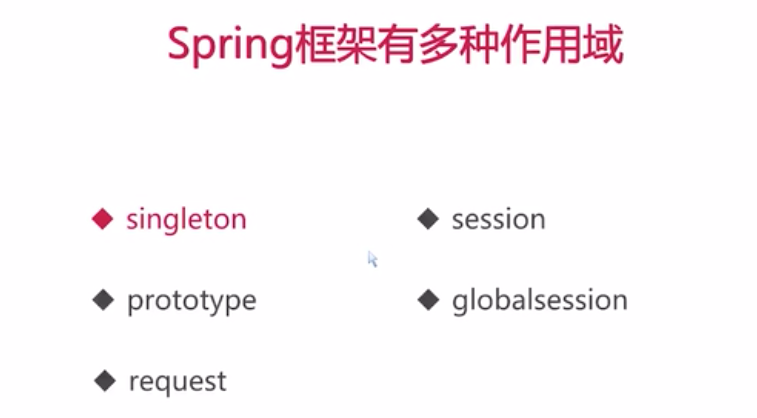
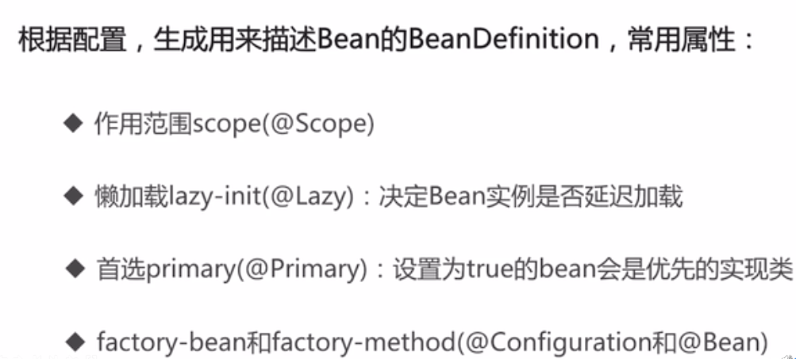

## 自建框架核心源码

### 定义注解
### 遍历所有的类（或者指定范围的类）

### 类加载器


### 容器
1、容器的单例定义

2、实现容器
- 容器的组成部分
    - 保存Class对象以及其实例载体
    - 容器加载
    - 容器的操作方式
    
3、实现容器的加载
- 实现思路
    - 配置的管理与获取
    - 获取指定范围内的Class对象
    - 依据配置提取Class对象，连同实例一并存入容器中
  
4、实现容器的操作方式
- 涉及到容器的增删改查
  - 增加、删除操作
  - 根据Class获取对应的实例
  - 获取所有的Class和实例
  - 通过注解来获取被注解标注的Class
  - 通过超类获取对应的子类Class
  - 获取容器载体保存Class数量
  
5、Spring 作用域


6、实现容器的依赖注入
- 实现思路
  - 定义相关的注解标签
  - 实现创建被注解标记的成员变量实例，并将其注入到成员变量里面
  - 依赖注入的使用
  
7、正式阅读Spring-framework的源码之前
- 无需刻意的在意版本的问题
- 所有的细节不能完全处理完成

8、Bean是Spring的一等公民
  - Bean的本质就是Java对象，只是这个对象的声明周期由容器管理
  - 不需要为了创建Bean而在原来的java类的基础上添加任何额外的限制
  - 对Java对象的控制方式体现在配置上

9、BeanDefinition - Bean的定义


10、ApplicationContext常用容器
  - AnnotationConfigServletWebServerApplicationContext
  - AnnotationConfigReactiveWebServerApplicationContext
  - AnnotationConfigApplicationContext

11、主要要掌握的是容器的共性
  - refresh() 大致功能

12、模板方法模式
  - 模板方法
  - 具体方法
    - 模板中自带的方法，一般不会发生改变
  - 勾子方法
    - 子类可以依据情况实现的方法
  - 抽象方法
    - 必须让子类实现的方法
  
13、后置处理器PostProcessor
  - 本身也是一种需要注册到容器中的Bean
  - 其里面的方法会在特定的时机被容器调用
  - 实现不改变容器或者Bean的核心逻辑的情况下对Bean进行扩展
  - 对Bean进行包装，影响其行为、修改Bean的内容等

14、责任链模式

15、Aware
  - 设置容器的感知

16、事件监听器模式
```
监听器将监听感兴趣的时间，一旦时间发生，便会立即做出响应
1) 事件源（Event Source）
2) 事件监听器（Event Listener） 
3) 事件对象（Event Object）
```
  - Spring事件驱动模型
    - 事件驱动模型的三大组成部分
      - 事件：ApplicationEvent 抽象类
      - 事件监听器：ApplicationListener
      - 事件发布器：Publisher 以及 Multicaster
